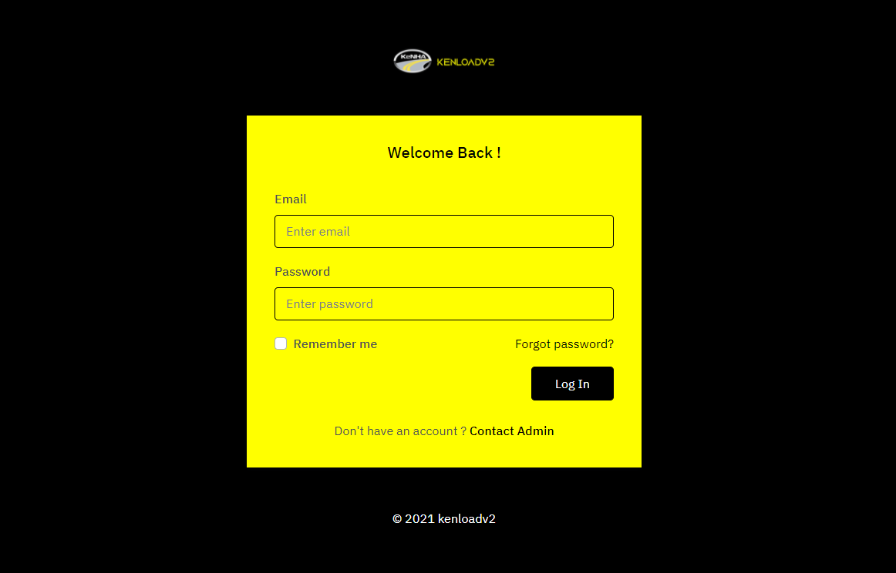

# overall Descriptions

For full Operation of the site visit [kenloadv2 Website](https://kenloadv2.netlify.app/).

## Product Perspective

#### HSMWIM Weighing Procedure
   
When a vehicle approaches the,

* HSWIM system picks the number plate 
* Picks date and time
* Gets the road location and lane
* Gets the vehicle speed
* Gets the vehicle length and distance between the axles
* Gets the number of axles
* Get the number of tire(s) the vehicle has
* Gets the vehicle weight per axle and also Gross Vehicle Weight (GVW).
* Gets the vehicle classification and computes against the permissible weight.
* Sends the results on the Variable Messaging Service (VMS) where the driver can see and know where the vehicle has been directed to.

The system will be integrated and stores the information for cross reference if the vehicle was called in and weighed on the static weighbridge.

#### Weighing Procedure(static/LSMWIM/SAW)

*	The vehicles approach the weighbridge. The Computer Operator Weighing (COW) checks and confirms the weighbridge is operational and working fine. Confirms the indicator that gets weight on the display shows zero (0) KG. Also confirms that the weighbridge is kept clean and no debris is blocking the weighbridge. 
*	 The COW will use the KENLOAD system to weigh the vehicle. The user sign in into Kenload and opens the weighing screen.

*	The Computer Operator on the Kenload system on the weighing module will click on Weigh button the boom open and the traffic lights will turn green. 
*	The vehicle enters the Multi Decks weighbridge or the axle the image will be taken and ANPR assist will get the vehicle number plate. Then the boom closes once the vehicle has passed the boom.

*	When the vehicle enter the weighbridge Kenload System picks the number plate using automatic number plate recognition and waits the operator to position the vehicles. Then the COW clicks next to show the weight value on the screen. Also shows on the remote displays outside.

*	If a vehicle has a permit the COW request for the permit number and enter which checks with the KeNHA servers and verifies the permit

*	The computer operator enters the other details trailer number, driver name, vehicle make, cargo, axle type, Transporter, origin, destination and any comments.
*	The COW takes the weight and advices the vehicle to proceed If the vehicle on the road or if the vehicle is overload or To redistribute or tagged the COW instructs the driver for a delivery note or driver license or a legal document that they can hold to until the vehicle weight is corrected.

*	The vehicle proceeds to the yard. If it is to redistribute then the prosecutor raise Impounded and Prohibited order and also raise Conditional Load Correction to allow the vehicle to start. Below are sample document

#### Presecution Procedure

The Computer Operator prosecutor (COP) will view list of all the overloaded vehicles. They will be able to select a vehicle to prosecute or prosecute any other vehicles that are not weighed in the system.
The prosecutor enters details of the owner, driver, transporter, location details, court details, Prohibition details.
The prosecutor then generates the relevant document for the specific overload. The various documents are prohibition order, Conditional Load Correction Memo, Charge Sheet and Load Correction Memo.

#### Vehicle Inspector Procedure

The vehicle inspector inspects the wide load vehicle at the station and takes various details of the vehicle. The inspector ensures that the vehicle is also in good condition. 

The system will allow the inspector to enter the vehicle details to reject and charge the vehicle owner and/or driver if the vehicle is not in accordance with the permit issued.

All the records will be stored in the system 

#### Clerk Census Procedure

The clerk census module will assist the clerk census who is counting the vehicle using the road by assisting in the input of the data they have collected and saving it into the system.
After they have collected the data the input the details in the system specifying the hour, direction or route, vehicle size and type

#### Duty Manager Procedure

The duty manager will be able to use most modules in the system to enable them manage the weighbridge. The specific modules used will be the yard monitoring, special release, overloaded vehicle, called in vehicles and get various notification.
The duty manage will be able to generate reports from the system

## Product Function

### Weighing Module

The vehicles being weighed in the system should have the following function;

*	Can weigh on LSWIM / MultiDeck / SAW
*	Can enter /edit vehicle registration
*	Permit scanning
*	Enter container or trailer number
*	Enter Driver or Vehicle make
*	Enter Cargo name
*	Can select axle configuration
*	Can select origin
*	Can select or enter Destination
*	Can direct the vehicle to the yard or exit
*	Can Issue a special release
*	Can print a ticket
*	Connection to the remote display
*	Control Traffic lights and Boom
*	Can connect to the indicator
*	Input indicator parameters
*	Connecting to the indicator
*	Can take the vehicle registration number
*	Can take and save the vehicle image
*	Can record any vehicle that steps on the weighbridge and store the details if not weighed.
*	Can calculate Pavement Damage Factor[PDF]

### Prosecution Module

The vehicles being prosecuted in the system should have the following function;

*	Can prosecute a vehicle
*	Can enter driver, owner , location, court and transporters details
*	Can create a prohibition order
*	Can create a Conditional Load Correction Memo
*	Can create a Charge Sheet
*	Can create Load Correction Memo
*	Can generate payment details
*	Can generate a special release
*	Can preview document
*	Can produce an EAC act document which can be charged either on GVW/Axle or both
*	Payment can be made through Mpesa or Banking and verification made by the system

### Vehicle Inspector Module

The wide load vehicles checking point in the system should have the following function;

*	Can Enter Vehicle Registration
*	Can enter permit number
*	Can scan permit
*	Can enter trailer registration
*	Can enter transporter Details
*	Can enter vehicle Model
*	Can enter origin and destination
*	Can select vehicle axle configuration
*	Can select if vehicle has First Aid Kit
*	Can select if vehicle has Fire Extinguisher
*	Can select if Driver is drunk
*	Can enter if driver has a valid license
*	Can enter if the vehicle has a valid insurance
*	Can enter if the vehicle has a valid inspection sticker
*	Can enter if the vehicle is in good condition
*	Can take measurement of the vehicle
*	Can enter the vehicle tire conformity
*	Can enter weight of the load
*	Can enter amount charged
*	Can enter travel date
*	Can enter authorized date
*	Can validate the permit 
*	Can remove a wrong entry
*	Can Accept or Reject the permit for various reason and charge vehicle in the system

### Census Clerk Module

The census clerk counting vehicle on the road, in the system should have the following function;

*	Can enter the date
*	Can select the shift
*	Can select the route
*	Can select the hour
*	Can enter Trucks greater than 7 tonnes
*	Can enter trucks greater than 3.5 Tonnes and less than 7 tonnes
*	Can enter the number of buses
*	Can show the user who added the record
*	Can remove a wrong entry
*	Can print the record

### Special Release Module

The Duty Manager managing the station, in the system should have the following function in the special release module;

*	User can see details of vehicle being release
*	Can see prosecution details
*	Can select reason for releasing
*	Can enter the more details for releasing vehicle
*	Can issue a special release document
*	Can display the charges paid
*	Can display the prosecutor name
*	When directed for weighing, shows the release
*	Can display the internal memo
*	Can print the record

### Directing Office Module

The directing office on the High Speed Weighing In Motion (HSWIM), in the system should have the following function;

*	Can show images of the vehicle
*	Can get the vehicle number plate automatically with ANPR
*	Can tag a vehicle
*	Can show if a vehicle is called in
*	Can show if a vehicle is overloaded
*	Can show previous vehicles
*	Can show multiple images
*	Can show the weight of the vehicle GVW
*	Can show weight per axle
*	Can call in vehicles
*	Can show the date and time
*	Can print the record
*	Can sound the alarm

### Administration Module

The system should have the following administration function;

*	Users can Sign in into the system
*	Users access can be created
*	Users can be given permission to access
*	User can change password
*	Audit trails of the user can be retrieved
*	Users and roles can be created
*	Users can be deactivated
*	Users can be assigned shift
*	User can exit the system
*	Users list can be printed
*	System can do backup
*	Weighbridges can be added
*	Password policy can be implemented

### Vehicle Tag Module

The system should tag a vehicle following administration function;

*	Vehicle can be tagged automatically or manually
*	Images can be added for the tag.
*	The tag ticket can be closed
*	The tag record can be tracked
*	You can print a tag
*	Can see the action taken for the tag

### Traffic Control Module

The system should have traffic control function;

*	Can turn traffic lights red or green
*	Can show the vehicle to exit or proceed to the yard
*	Can open and close the boom

### Monitoring/ Health Check Module

The system should have a monitoring function to ensure all hardware they are working;

*	Can monitor the cameras if on or off
*	Can monitor the vehicle on the site
*	Can monitor the pc are on
*	Can monitor indicator is on

### Mobile Weighing Module
The system should have a mobile weighing module with the following function;

*	Can run on a mobile device
*	Can input weight of the vehicle
*	Can input vehicle details
*	Can input the location or route
*	Can print a ticket
*	Can synchronize data online to the server

### Weighbridge Management Module

The system should have the ability to integrate all Weighbridge Station into one system where in the main system the user can see all records from the sites.

## Operating Environment

The Kenload Weighbridge Management System is a web based application and shall operate in all famous browsers therefore it can run on any operation system. It will be accompanied by mobile application which will run on both Android and IOS

## Design and Implementation Constraints

The information of all users, roles, vehicles weighed, vehicle prosecuted, vehicle inspector and clerk censors must be stored is a database that is accessible.
MS SQL server will be used as SQL engine and database.

The Kenload Weighbridge Management system will be running 24 hours a day

Users must have their correct usernames and passwords to enter into their system.

The main Kenload WMS system will be available over the internet and will require internet connection to access. 

## User Documentation

The Kenload Weighbridge Management System will have a user manual that would be written to help understand the working methodology and usage of the developed prototype system. It would be written for non-technical individuals and the level of content or terminology would differ considerably from the Technical Administration Guide, which is more detailed and complex. 

The user manual would follow common user documentation styles capturing purpose and scope of the product along with key system features and operations; step-by-step instructions for using the system including conventions, messaging structures, quick references, tips for errors and malfunctions; pointers to reference documents; and glossary of terms.

## Assumption and Dependencies

This product would build on leveraging existing systems. In this regard, necessary inspirations could be obtained by analyzing related systems such as Kenwei and Kenload Version 1. In particular, the design and implementation approach of Kenwei and Kenload Version1 could be helpful to draw a clear guideline for developing the intended prototype.

This system will need third party products like Microsoft SQL Server to store the database. Will require javascript, Vuejs, Nodejs, React Native to develop the product.

The system will require all the hardware like Boom, traffic lights, cameras, loops and PLC to work in order to control and get the proper results.

## Nonfunctional Requirements
Non-functional requirements capture the system attributes which are outside the functionalities and cover the software quality attributes like performance, availability, compatibility, maintainability, security, and usability aspects as detailed below.

### Performance and Availability Requirements
User feedback highlighted the slow response of the current system. Therefore performance improvement will be a key aspect in this new version.

Performance will be measured in terms of both availability, speed and reliability.
Availability: The system should be highly available to guarantee 24/7 uninterrupted usage.
Speed: The system's response time (TAT) must be within acceptable levels.
Reliability: All system modules should be seamlessly responsive to enable smooth transactions without a break in the process for all modules.

### Compatibility and Maintainability Requirements
The system should be compatible with and be able to run on a Windows environment with the backend database running on Microsoft MSSQL engine.
The system’s mobile app version should be compatible with and be able to run on both android and iOS.
Maintainability: To cater for future upgrades of the underlying OS environment, the system should be compatible with Windows Security Updates.

###	Security Requirements
To guarantee security of the system generated data, an audit trail of user activities will be implemented and maintained to enable tracking and remediation.
The system should be able to support Active Directory Single Sign-On and Multi-User password control.

###	Usability Requirements
The system should have an intuitive GUI to guarantee a short learning curve and good UX for its users.Documentation and module descriptions will be included to support user training and on-boarding.

###	Support Requirements
The system should enable logging to make it easy for System Administrators to support and troubleshoot incidences.

###	Test Requirements

The system should support testing both at the:

*	`Unit/module level`
*	`System level`

## Project layout

    mkdocs.yml    # The configuration file.
    docs/
        index.md  # The documentation homepage.
        ...       # Other markdown pages, images and other files.
