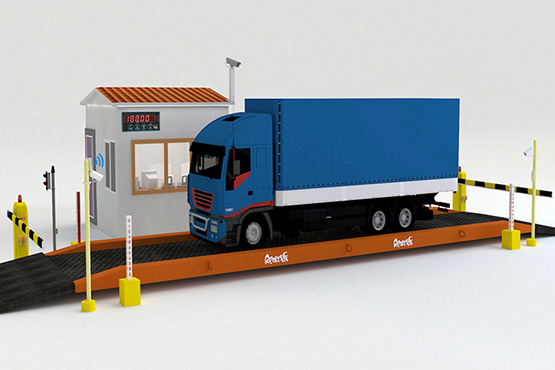

# Welcome to KenloadV2

For full Operation of the site visit [kenloadv2 Website](https://kenloadv2.netlify.app/).

## Purpose

The purpose of this document is to present a detailed description of the Kenload Version 2 Weighbridge Management System. It will explain the purpose and features of the system, the interfaces of the system, what the system will do, the constraints under which it must operate. 
KeNHA intends to Services for Upgrading its Kenload Weighbridge Management System to be rolled out at the Weighbridges and across all the axle load control facilities in Kenya. 

## Document Conventions

When writing this SRS for KeNHA, the following terminologies are used:
Web server (WS): The container of content comprising of two layers overlay, which is a collection of Web service host (e.g. Apache, Tomcat), Service Level Agreement (SLA)-allocator, and policy agent, and core, which refers to the underlying hardware infrastructure.

## Scope of Project

The Weighbridge Management System will be web application that provides web based dynamic dashboard and web portal for access to monitor weighbridge operation for enhanced axle load compliance

